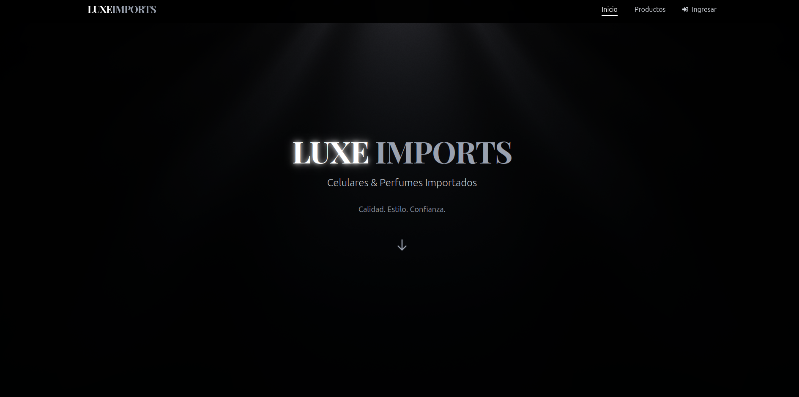
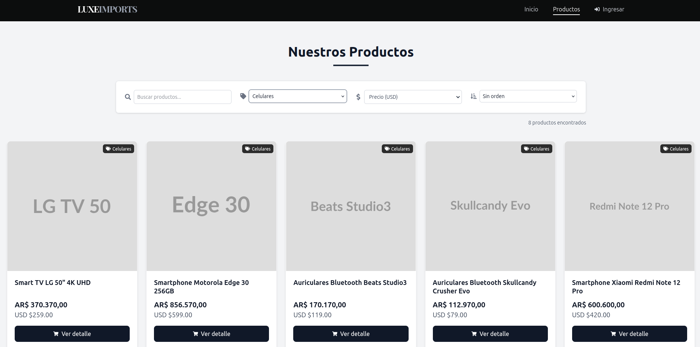
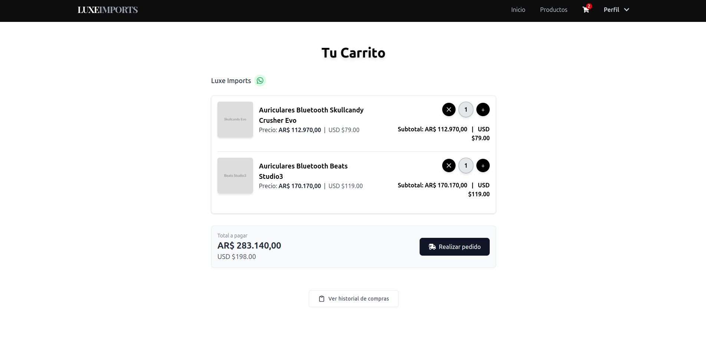
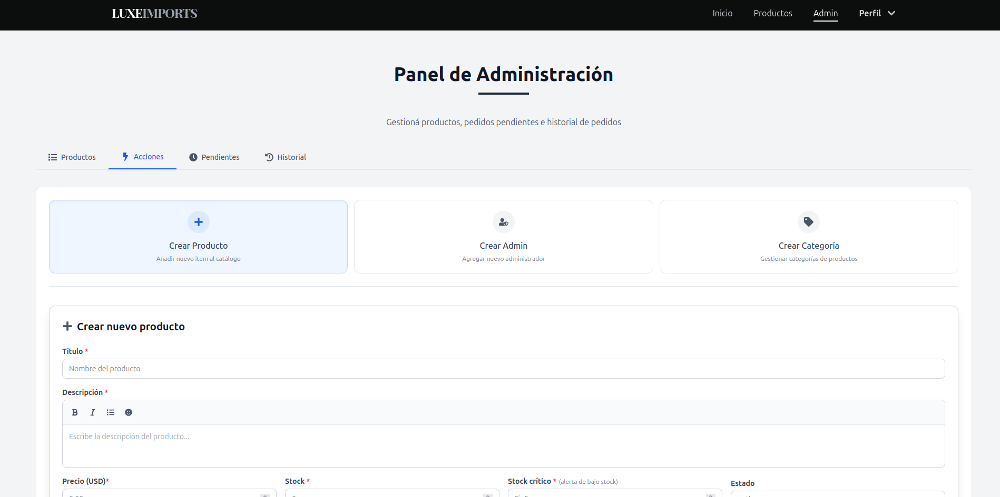

# 🛍️ Luxe Imports

[](https://reactjs.org/)
[](https://nodejs.org/)
[](https://mongodb.com/)
[](https://tailwindcss.com/)

> **Una tienda online moderna y elegante para productos importados de lujo**

¡Bienvenido a **Luxe Imports**! Una plataforma de e-commerce completa que combina diseño moderno con funcionalidad robusta. Desarrollada para ofrecer una experiencia de compra excepcional tanto para usuarios como para administradores.

## 🎯 ¿Qué es Luxe Imports?

Luxe Imports es una **tienda online especializada en productos importados de alta calidad**. La plataforma permite a los usuarios explorar un catálogo cuidadosamente curado, gestionar su carrito de compras de forma intuitiva y disfrutar de una experiencia de navegación fluida y moderna.

El proyecto incluye tanto la **interfaz de usuario** para los compradores como un **panel de administración** completo para gestionar productos, categorías y usuarios de manera eficiente.

## ✨ Características Principales

### Para los Usuarios
- 🔐 **Sistema de autenticación completo** - Registro, login y gestión de perfil
- 🛍️ **Catálogo intuitivo** - Navegación por categorías con filtros avanzados
- 🛒 **Carrito persistente** - Mantiene los productos seleccionados entre sesiones
- 📱 **Diseño responsive** - Experiencia optimizada en móviles, tablets y desktop
- ⚡ **Interfaz moderna** - Diseño limpio y atractivo con animaciones suaves

### Para los Administradores
- 📦 **Gestión completa de productos** - Crear, editar y eliminar productos con imágenes
- 🏷️ **Sistema de categorías** - Organización flexible del catálogo
- 👥 **Administración de usuarios** - Control total sobre cuentas y permisos
- 📊 **Panel de control intuitivo** - Interfaz administrativa fácil de usar

## 🛠️ Tecnologías Utilizadas

### Frontend
- **React 18** - Biblioteca moderna para interfaces de usuario
- **TailwindCSS** - Framework de CSS para diseño rápido y consistente
- **Zustand** - Gestión de estado ligera y eficiente
- **Vite** - Herramienta de desarrollo ultrarrápida

### Backend
- **Node.js** - Entorno de ejecución JavaScript del lado del servidor
- **Express.js** - Framework web minimalista y flexible
- **MongoDB** - Base de datos NoSQL para máxima flexibilidad
- **JWT** - Autenticación segura basada en tokens

## 📸 Capturas de Pantalla

### Página Principal

*Diseño moderno y atractivo que invita a explorar el catálogo*

### Catálogo de Productos

*Navegación intuitiva con filtros y categorías organizadas*

### Carrito de Compras

*Gestión simple y clara de productos seleccionados*

### Panel de Administración

*Herramientas completas para gestionar la tienda*

<!-- TODO: Agregar capturas reales del proyecto -->

## 🚀 Cómo Ejecutar Localmente

Si quieres explorar el código o contribuir al proyecto:

```bash
# Clonar el repositorio
git clone https://github.com/novarasoft/luxe-imports.git
cd luxe-imports

# Instalar dependencias del backend
npm install

# Instalar dependencias del frontend
cd client && npm install

# Ejecutar la aplicación (requiere MongoDB)
npm run dev  # Backend
cd client && npm run dev  # Frontend
```

## 👥 Equipo de Desarrollo

**Novara Soft** - Estudio de desarrollo especializado en soluciones web modernas

- **Gonzalo Kintal** - Full Stack Developer
- **Joaquín Tonizzo** - Frontend Developer  
- **Franco Mendoza** - Backend Developer

## 📞 Contacto

¿Te interesa el proyecto o quieres colaborar?

- 📧 **Email**: contacto@novarasoft.com
- 🌐 **Website**: [novarasoft.com](https://novarasoft.com)
- 💻 **GitHub**: [@novarasoft](https://github.com/novarasoft)

---

⭐ **¿Te gusta el proyecto?** ¡Dale una estrella en GitHub y compártelo!